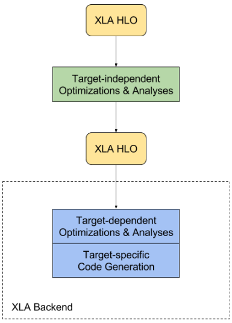

## TensorFlow XLA

TensorFlow XLA, short for Accelerated Linear Algebra, is a domain-specific compiler for linear algebra that optimizes TensorFlow computations. It mainly focuses on speed, memory usage, and portability on server and mobile platforms.

### Overview
The input language to XLA is a compiler IR called `HLO IR`, here HLO is short for `High Level Optimizer`. XLA takes graphs ("computations") defined in HLO and compiles them into machine instructions for various architectures. XNA architecture is shown below:

XLA comes with several optimizations and analyses that are target-independent, such as common subexpression elimination([CSE](https://en.wikipedia.org/wiki/Common_subexpression_elimination)), target-independent operation fusion, and buffer analysis for allocating runtime memory for the computation.

After the target-independent step, XLA sends the HLO computation to a backend. The backend can perform further HLO-level analyses and optimizations, this time with target specific information and needs in mind. For example, the XLA GPU backend may perform operation fusion beneficial specifically for the GPU programming model and determine how to partition the computation into streams. At this stage, backends may also pattern-match certain operations or combinations thereof to optimized library calls.

The next step is target-specific code generation. The CPU and GPU backends included with XLA use LLVM for low-level IR, optimization, and code-generation. These backends emit the LLVM IR necessary to represent the XLA HLO computation in an efficient manner, and then invoke LLVM to emit native code from this LLVM IR.

XLA currently supports JIT compilation on x86-64 and NVIDIA GPUs; and AOT compilation for x86-64 and ARM.

### Reference
- [tensorflow xla](https://www.tensorflow.org/performance/xla/)
- [tensorflow xla framework](https://www.tensorflow.org/versions/master/resources/xla_prerelease.html)
- [google XLA - TensorFlow, compiled](https://developers.googleblog.com/2017/03/xla-tensorflow-compiled.html)
- LLVM developers meeting 2017-03 - [XLA: Accelerated Linear Algebra - Technical Talk](http://llvm.org/devmtg/2017-03/) & video [here](https://www.youtube.com/watch?v=2IOPpyyuLkc)
